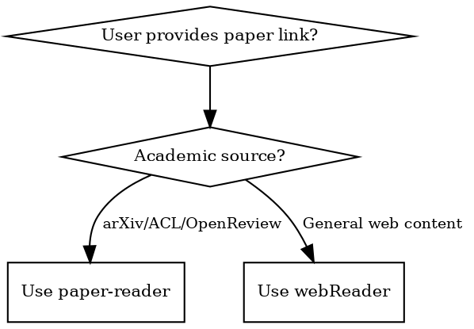

# Paper Reader

## Overview

Transform academic papers into actionable knowledge structures. Not simple summaries, but critical extraction: core contributions, technical essence, borrowable insights, critical assessment. Output three formats: Deep Analysis, Notes Card, Quick Scan.

**Assumption**: Papers are already downloaded and converted to Markdown format (`.md` + `_metadata.json`) in `papers/{paper_id}/` directory.

## When to Use



**Triggers:** arXiv/ACL/OpenReview links, or Chinese phrases "读论文", "分析这篇", "帮我看看"

**NOT for:** Non-academic web pages (use webReader)

## Sub-Skills

Three output formats can be invoked independently:

| Sub-Skill | File | Output | Use Case |
|-----------|------|--------|----------|
| `paper-quick` | `references/paper-quick.md` | `_quick.md` | Quick paper filtering, decide whether to read deeply |
| `paper-notes` | `references/paper-notes.md` | `_notes.md` | Condensed note cards, quick review |
| `paper-deep` | `references/paper-deep.md` | `_deep.md` | Full deep analysis, critical assessment |

When you only need a specific format, directly invoke the corresponding sub-skill.

## Quick Reference

| Step | Output | Source | Purpose |
|------|--------|--------|---------|
| 1. Context | `{id}.md` | 原始论文 | 读取 Markdown，识别关键图片 |
| 2. Deep | `{id}_deep.md` | 从论文 | 完整分析 + 嵌入图片 |
| 3. Notes | `{id}_notes.md` | **从 deep** | 提炼关键点 |
| 4. Quick | `{id}_quick.md` | **从 deep** | 极简摘要 |

**Key**: MinerU preserves document structure (heading levels, tables, formulas, lists), better than plain Markdown for LLM understanding of paper structure.

## Expected Directory Structure

Papers should be pre-processed and available in:

```
papers/{paper_id}/
├── {paper_id}.md             # MinerU markdown (LLM context) ← READ THIS
├── {paper_id}_metadata.json  # arXiv metadata (title, authors, etc.)
├── {paper_id}_middle.json    # MinerU raw document data (optional)
├── {paper_id}_deep.md        # ← YOUR OUTPUT (Full analysis)
├── {paper_id}_notes.md       # ← YOUR OUTPUT (Condensed notes)
└── {paper_id}_quick.md       # ← YOUR OUTPUT (Quick scan)
```

## Workflow

**当用户请求分析论文时，必须执行以下步骤：**

1. **Read Deep Template**: 读取 `.claude/skills/paper-reader/references/paper-deep.md`
2. **Generate Deep**: 根据模板分析原始论文，生成 `papers/{paper_id}/{id}_deep.md`
3. **Read Notes Template**: 读取 `.claude/skills/paper-reader/references/paper-notes.md`
4. **Generate Notes**: **从 `_deep.md` 提炼**，按 notes 模板格式生成 `{id}_notes.md`
5. **Read Quick Template**: 读取 `.claude/skills/paper-reader/references/paper-quick.md`
6. **Generate Quick**: **从 `_deep.md` 提炼**（不是从 notes），按 quick 模板格式生成 `{id}_quick.md`

**重要**：
- Notes 和 Quick 都从 Deep 提炼，避免信息链式衰减
- 必须完整执行三个步骤，不能跳过

## Paper ID Format

- **arXiv**: `{arxiv_id}/` → e.g., `papers/2407.11730/`
- **CVF**: `cvf_{conference}{year}_{method}/` → e.g., `papers/cvf_CVPR2025_SDGOCC/`

**NEVER manually create folders**. Always use the paper_id from the existing folder or `_metadata.json`.

## Common Mistakes

| Mistake | Why It Happens | Fix |
|---------|---------------|-----|
| Creating folders manually | Improper naming like `SDGOCC_2025` instead of `cvf_CVPR2025_SDGOCC` | ALWAYS use the paper_id from the existing folder or `_metadata.json` |
| Only output summary | Taking shortcuts | Must follow full pipeline: Deep → Notes → Quick |
| Skip critical analysis | Author-biased thinking | Actively identify weaknesses and limitations |
| Ignore experimental details | Focus on method, overlook experiments | Carefully analyze setup, baselines, ablation |
| Miss connections | Reading papers in isolation | Actively find related work, cite arXiv IDs |
| Vague verdict | Unwilling to judge | Clearly give [MUST READ]/[SKIM]/[SKIP] with reason |
| 忽略论文中的图片 | 识别并嵌入对理解关键内容有帮助的图片 | 根据论文实际情况灵活判断 |
| 图片路径错误 | 使用 `images/xxx.jpg` 相对路径 | 相对于论文目录的相对路径 |

## Red Flags - STOP and Reconsider

- Thinking "just generate a summary"
- Planning to "skip deep analysis, they probably just want quick"
- Wanting to "only do what the user explicitly asked for"
- Saying "the user can decide if they want deep analysis"
- Planning to "copy the authors' claims without critique"
- **Manually creating folders** (always use existing folder or `_metadata.json`)
- **Inferring folder names from title** (always use existing folder or `_metadata.json`)

**All of these mean: You're treating this as a summarization task. Re-read this skill.**

## Rationalization Defense

| Rationalization | Reality |
|-----------------|---------|
| "User just wants a quick summary" | The skill's value is the complete pipeline. Quick scan alone = half-baked. |
| "Deep analysis takes too much space" | Space is cheap. Insight is valuable. |
| "The authors already explained it well" | Your job is critical extraction, not paraphrasing. |
| "I don't know enough to critique" | You can identify obvious gaps: missing baselines, limited datasets, unclear claims. |

## Finding Open Source Links

**Check order**:
1. Paper text (last paragraph of abstract, conclusion, or acknowledgments)
2. GitHub search: `github.com/{first_author_last_name}/{paper_name}`
3. Project website (often in author affiliation)
4. Google Scholar: "Code" link below citation

## Supporting Files

### Reference Files
- **`references/paper-deep.md`** - Full deep analysis template with reading framework and critical assessment guide
- **`references/paper-notes.md`** - Condensed notes template for quick review and literature organization
- **`references/paper-quick.md`** - Quick scan template with verdict grading criteria

### Examples
- **`examples/2304.14365_quick.md`** - Complete quick scan example (Occ3D paper)
- **`examples/2304.14365_notes.md`** - Complete notes example (Occ3D paper)
- **`examples/2304.14365_deep.md`** - Complete deep analysis example (Occ3D paper)
